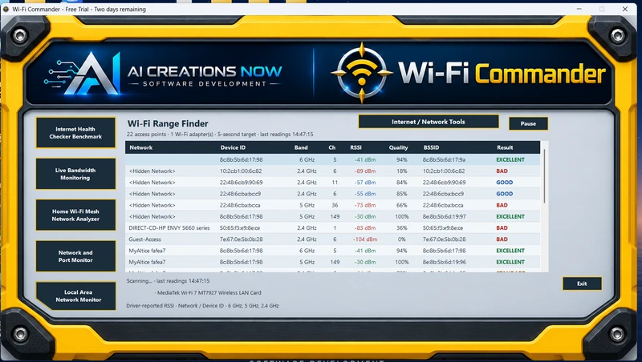
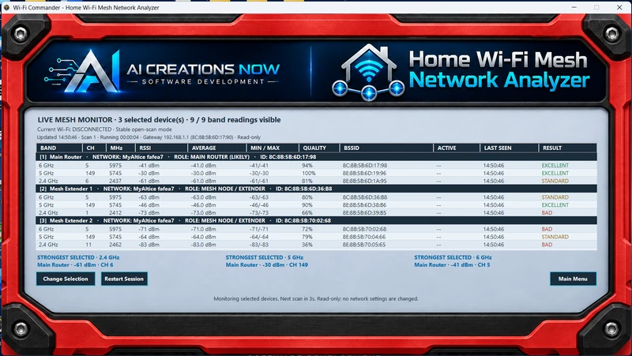
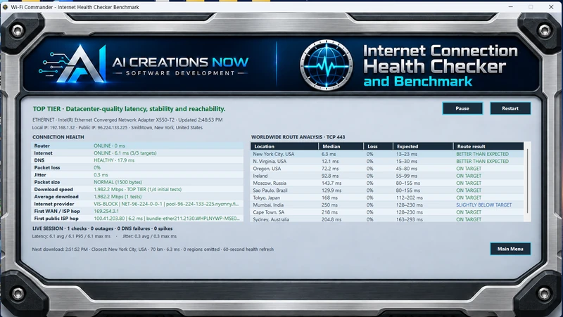
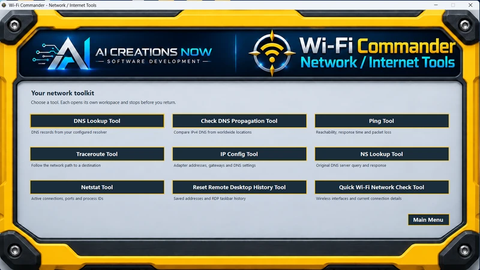

<h1 align="center">Wi-Fi Commander</h1>

<strong>Your home. Your network. In focus.</strong>

  

**Wi-Fi analysis, home mesh monitoring, and everyday network diagnostics for Windows.** Find weak spots in your wireless coverage, check your Internet connection, and inspect local network activity from one application by [AI Creations Now Software Development](https://aicreatenow.com/).

  <a href="https://download.aicreatenow.com/software/wifiCommander2.1.1microsoft.exe">Download the two-day free trial</a> · <a href="https://aicreatenow.com/WiFiCommander.html">Official product page &amp; purchase</a> · <a href="https://aicreatenow.com/WiFiCOMPrivacy.html">Privacy policy</a>

<strong>Version 2.1.1 · Windows 10 / 11 · x64 · $4.99 lifetime license · One computer · No subscription</strong>

## What you can do

| Feature | What it shows |
| --- | --- |
| **Live Wi-Fi Range Finder** | Nearby networks, signal strength in dBm, signal quality, bands, channels, and Windows-reported radio information |
| **Home Wi-Fi Mesh Network Analyzer** | Readings for the router, mesh nodes, and access points you select, with current, average, minimum, and maximum signal measurements |
| **Internet Connection Health Checker and Benchmark** | Router and Internet response, latency, jitter, packet loss, interruptions, DNS health, regional response, and download performance |
| **Live Bandwidth Monitor** | Current and peak download/upload rates, transferred totals, and elapsed time in an always-on-top window |
| **LAN Monitor** | Visible local devices, available names and hardware addresses, response times, and first- and last-seen times within the displayed private IPv4 scope |
| **Network and Port Monitor** | Local TCP listeners and UDP endpoints, associated programs/services, and public IPv4 TCP reachability checks |
| **Nine Network / Internet Tools** | DNS Lookup, DNS Propagation, Ping, Traceroute, IP Config, NS Lookup, Netstat, Quick Wi-Fi Network Check, and Reset Remote Desktop History |

Use a compatible Windows laptop or tablet to compare Wi-Fi coverage room by room. Internet health, bandwidth, LAN, port, and network diagnostic tools also work on an Ethernet-connected desktop.

## See the application

### Live Wi-Fi Range Finder

Compare nearby signals and open the rest of the toolkit from the main dashboard.

### Home Wi-Fi Mesh Network Analyzer

Select your own equipment, give it familiar names, and compare available 2.4, 5, and 6 GHz readings as you move around your home. Available bands and details depend on your adapter, driver, Windows, and network equipment.

### Internet health and download performance

Look beyond signal bars with connection response, stability, and download measurements.

### Network / Internet Tools

Open focused diagnostic tools without starting a separate command prompt.

Screenshots show example readings from the publisher's equipment; your results will vary. [Explore all features and full-size screenshots](https://aicreatenow.com/WiFiCommander.html).

## Trial and lifetime license

| Option | Details |
| --- | --- |
| **Free trial** | 48 elapsed hours from when you choose to start the trial; time continues while the application is closed |
| **Lifetime license** | $4.99 for one computer, with no subscription |
| **Purchase before trial** | Enter your purchased key and activate online when you first open the application |

Installing the application does not start the trial. When the trial expires, a license is required to continue. See the [official product page](https://aicreatenow.com/WiFiCommander.html) for the current offer and purchase link.

## Requirements and compatibility

| Requirement | Details |
| --- | --- |
| Windows | Windows 10 or Windows 11 with support for x64 desktop applications |
| Runtimes | .NET Framework 4.8 or later and Windows PowerShell 5.1 |
| Wi-Fi scanning and mesh analysis | An enabled, compatible Wi-Fi adapter; Windows Location / nearby-network access may be required |
| Internet and wired-network tools | An active Wi-Fi or Ethernet connection; online tests require Internet access |
| Download benchmark | Windows curl utility and an Internet connection |
| License activation | Purchased license key and Internet access; Windows may request permission to save protected trial or activation information |

**Current display notice:** the official product page reports compressed or squished layouts on ultra-wide and curved-monitor configurations. A display hotfix is in progress. Version 2.1.1 restores the original main and diagnostic layouts; it does not claim to resolve that compatibility issue. Check the [product page](https://aicreatenow.com/WiFiCommander.html) for updates.

## Get started

**Download the Windows application from the official link below.** GitHub's **Code → Download ZIP** contains this repository's documentation and artwork, not the application installer.

1. Download the [digitally signed Windows x64 installer](https://download.aicreatenow.com/software/wifiCommander2.1.1microsoft.exe).
2. Review the [privacy policy](https://aicreatenow.com/WiFiCOMPrivacy.html), install, and open Wi-Fi Commander.
3. Choose the two-day trial or enter your purchased key to activate online.
4. For nearby Wi-Fi and mesh readings, enable a compatible Wi-Fi adapter and allow the Windows access needed for scanning.
5. Choose the tool you need. For mesh analysis, select your equipment before beginning the monitoring session.

See [version notes](CHANGELOG.md) for the 2.1.1 layout changes and [GitHub releases](https://github.com/aicreatenowdom/wifi-commander/releases) for published version entries.

## Understanding the readings

- **Signal, not distance:** Range Finder measures signal strength; it does not measure feet or meters or automatically change router settings.
- **Mesh roaming:** an access-point or network connection change stops the monitoring session. Restart to establish a new baseline.
- **Bandwidth versus speed tests:** Live Bandwidth Monitor reads Internet and LAN traffic on one selected adapter. It is not a per-application usage report or an upload benchmark.
- **Download data use:** each download benchmark requests about 100 MiB. Four initial successful tests use about 400 MiB, followed by tests no more often than every two hours. Failed attempts can use additional data. Restarting the session repeats the initial series.
- **LAN visibility:** sleeping, isolated, or filtered devices may not appear. The displayed scope is not an inventory of every subnet or VLAN.
- **Public ports:** external checks test public IPv4 TCP ports. A reachable port may belong to your router or another device; it does not prove this computer is reachable. UDP and public IPv6 are not externally tested.
- **RDP history:** Reset Remote Desktop History requires confirmation. It clears remembered and pinned connection history while preserving saved credentials and passwords.

## Privacy

Local Wi-Fi, mesh, and bandwidth readings are used on the computer. Online diagnostics make network requests to third-party services and generate real traffic. Public port checks submit your public IPv4 address and applicable TCP port numbers; Globalping DNS Propagation measurements are public, so do not submit private names you do not intend to share.

Online activation sends the entered key, a hardware-derived machine identifier, installation identifier, Windows computer name, and application version to the publisher's licensing service. The server also sees the source public IP and ordinary request metadata. Wi-Fi scans, full diagnostic reports, passwords, and RDP history are not included in that activation request.

Read the [complete Wi-Fi Commander privacy policy](https://aicreatenow.com/WiFiCOMPrivacy.html) for feature-specific details and third-party services. Redact network identifiers and personal information before posting screenshots or reports publicly.

## Support

Email [info@aicreatenow.com](mailto:info@aicreatenow.com) or call **1-866-315-4750**. Include your application version, Windows version, affected tool, and the steps that reproduce the problem. See [SUPPORT.md](SUPPORT.md) for helpful troubleshooting details.

[Official product page](https://aicreatenow.com/WiFiCommander.html) · [Privacy policy](https://aicreatenow.com/WiFiCOMPrivacy.html) · [Software refund policy](https://aicreatenow.com/cancellation.html#software-refunds)

## Source and licensing

Wi-Fi Commander is proprietary software. This repository provides public product information, screenshots, and support documentation. **Application source code is not included, and no open-source license for the application is granted by this repository.** Obtain the installer and applicable terms through the official product page.

Product names and trademarks belong to their respective owners. References to third-party services do not imply endorsement or affiliation.

---

Developed by [AI Creations Now Software Development](https://github.com/aicreatenowdom) · [Official software catalog](https://aicreatenow.com/software.html)
